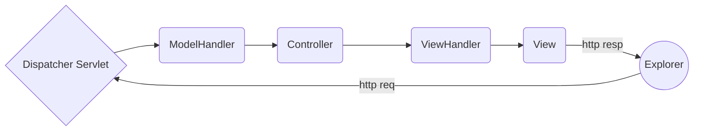

# SpringMVC从入门到放弃

SpringMVC到处充满问题。本文是作者踩了无数坑写出来的。希望这篇教程能让大家少走弯路。

[TOC]

## SpringMVC Spring SpringBoot之间的区别

1. Spring 相当于引擎，任何基于 Spring 的项目都离不开它提供的 Ioc DI（控制反转 + 依赖注入）。
2. SpringMVC是web框架，当然它是基于 Spring 的。
3. SpringBoot是Spring项目的快速启动器，做到了开箱即用，用它做SpringMVC项目不用麻烦的配置各种XML，而是注重业务逻辑的开发。不是很了解。

## SpringMVC原理



1. 用户浏览器发送request，DispatcherServlet 接收后，选择合适的 Model Handler 处理数据。
2. Dispatcher Servlet 选择合适的 Controller 处理业务逻辑。
3. Controller 中的一些方法返回 String / Model 等，由 View Handler 选择合适的页面进行跳转。
4. Response 返回浏览器。

## Maven使用说明

Maven 相当于 Python 的 Anaconda，是一个 Java 的包依赖管理工具。使用时只需将需要的包的信息写入 Pom.xml 文件，maven 就会从远程服务器搜索对应的包安装到本地仓库。下次使用时也只需要配置信息就能调用。

一个 基于SpringMVC 的 Maven 工程的结构最好按照以下结构来构建：

```text
+ Project
|___+ src
	|___+ main
		|___+ java
			|___com.galaxyzeta
				|___controllers
					|___[C]HelloWorldController
				|___pojo
					|___[C]User
		|___+ resources
		|___+ webapp
			|___+ WEB-INF
				|___web.xml
				|___applicationContext.xml
				|___dispatcher-servlet.xml
	|___+ test
|___+ target
|___pom.xml
|___Project.iml
```

Maven pom.xml 的书写样例：

```xml
<dependencies>
      <groupId>junit</groupId>
      <artifactId>junit</artifactId>
      <version>4.11</version>
      <scope>test</scope>
    </dependency>
    <dependency>
      <groupId>org.springframework</groupId>
      <artifactId>spring-web</artifactId>
      <version>4.2.6.RELEASE</version>
    </dependency>
</dependencies>
```


## 配置SpringMVC的困扰

1. Tomcat 服务器报错，找不到 ContextListener 类。解决方法：SpringMVC项目根目录下创建 lib 把所有 Spring 相关包放进去，项目依赖中，选择所有 Spring 相关包。
2. 找不到静态资源。
3. 其余问题全部用如下配置解决：

**dispatcher-servlet.xml**

```xml
<?xml version="1.0" encoding="UTF-8"?>

<!-- 设置下面部分配置要用到命名空间 -->

<beans xmlns="http://www.springframework.org/schema/beans"
       xmlns:xsi="http://www.w3.org/2001/XMLSchema-instance"
       xmlns:context="http://www.springframework.org/schema/context"
       xmlns:mvc="http://www.springframework.org/schema/mvc" xmlns:p="http://www.springframework.org/schema/p"
       xsi:schemaLocation="http://www.springframework.org/schema/beans
       http://www.springframework.org/schema/beans/spring-beans-4.2.xsd
    http://www.springframework.org/schema/mvc
    http://www.springframework.org/schema/mvc/spring-mvc-4.2.xsd
    http://www.springframework.org/schema/context
    http://www.springframework.org/schema/context/spring-context-4.2.xsd">
    
    <!-- 启用包扫描，确保Controller类能被识别 -->
    <context:component-scan base-package="com.galaxyzeta.controllers"/>
    <!-- 视图解析器，给返回的视图添加前后缀 -->
    <bean class="org.springframework.web.servlet.view.InternalResourceViewResolver" p:prefix="/WEB-INF/html/"
          p:suffix=".html"/>	
    <!-- 启用注解功能便于开发 -->
    <mvc:annotation-driven/>
    <!-- 解决html后缀文件找不到的问题 -->
    <mvc:default-servlet-handler/>
    <!-- 目前唯一的解决静态资源无法找到的方案。这里的reources必须在WEB-INF下，这句话代表把WEB-INF/resources 映射到 artifact 的 WEB-INF/resources/** 中了-->
    <mvc:resources mapping="resources/**" location="/WEB-INF/resources/" />
</beans>
```

**applicationContext.xml**

基本不用动。

```xml
<?xml version="1.0" encoding="UTF-8"?>
<beans xmlns="http://www.springframework.org/schema/beans"
       xmlns:xsi="http://www.w3.org/2001/XMLSchema-instance"
       xsi:schemaLocation="http://www.springframework.org/schema/beans http://www.springframework.org/schema/beans/spring-beans.xsd">
</beans>
```

**web.xml**

```xml
<?xml version="1.0" encoding="UTF-8"?>
<web-app xmlns="http://xmlns.jcp.org/xml/ns/javaee"
         xmlns:xsi="http://www.w3.org/2001/XMLSchema-instance"
         xsi:schemaLocation="http://xmlns.jcp.org/xml/ns/javaee http://xmlns.jcp.org/xml/ns/javaee/web-app_4_0.xsd"
         version="4.0">
    <context-param>
        <param-name>contextConfigLocation</param-name>
        <param-value>/WEB-INF/applicationContext.xml</param-value>
    </context-param>
    <listener>
        <listener-class>org.springframework.web.context.ContextLoaderListener</listener-class>
    </listener>
    <servlet>
        <servlet-name>dispatcher</servlet-name>
        <servlet-class>org.springframework.web.servlet.DispatcherServlet</servlet-class>
        <load-on-startup>1</load-on-startup>
    </servlet>
    <servlet-mapping>
        <servlet-name>dispatcher</servlet-name>
        <url-pattern>/</url-pattern>		<!-- 这里必须是/，可以拦截所有请求 -->
    </servlet-mapping>
    <!-- 设置欢迎界面 -->
    <welcome-file-list>
        <welcome-file>/WEB-INF/html/hello.html</welcome-file>
    </welcome-file-list>
</web-app>
```


## 理论方法

### Spring常用注解

### SpringMVC常用注解

| 注解                                   | 描述                                        |
| -------------------------------------- | ------------------------------------------- |
| @Controller                            | 指定被注解的类是控制器                      |
| @RequestMapping(value=xxx, method=xxx) | 指定被注解的方法对应的相对URL路径和访问方法 |
| @RequestParam(value=xxx)               | 指定参数是Requset带的参数                   |
| @ResponseBody                          | 指定方法返回响应体                          |


### 后台接收前台数据

1. 万能方法，用HttpServletRequest接收，详细的内容在Servlet中已经讲述过了。
2. 参数中的方法名用参数名。这能被 Spring 自动识别。
3. 参数中的方法名任意，但必须用 @RequestParm加以说明。
4. 用POJO类接收，前提是POJO中的属性要和参数一样。
5. 参数中包含ModelMap 或 Model 或 Map<String, Object>，这样既能接收前台数据，也能把数据修改后重新发到前台。（目前我还不会在html页面接收Model传递的参数）

### 前台怎么接收后台数据？

1. 如果前台是 jsp 页面，则直接用EL表达式，即 `${xxxxx}`
2. 如果前台是 html 页面，可以用 ajax 发出请求，后台方法注解为 @ResponseBody，然后用打印的方法返回JSON，再用 ajax 接收。

### 后台传递参数给前台并跳转页面

1. 方法返回 String， 则 Spring 会用视图解析器为它加上前后缀，自动前往指定页面。
2. 方法返回 ModelAndView，既能前往页面又能携带参数（不过这些参数是给 jsp 准备的）
3. 方法参数表接收 Model 或者 ModelMap，Model 部分和 2 所述同理。

## HelloWorld 项目实战

WIP

