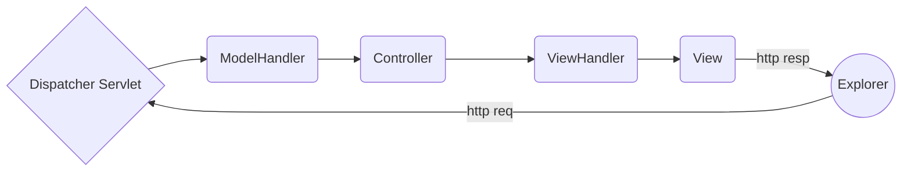
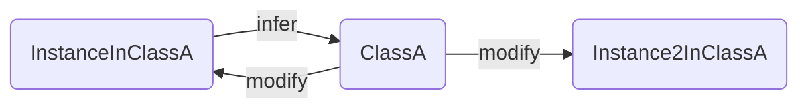

# SSM框架从入门到放弃

**导读：**

本文是作者踩了无数坑写出来的。希望这篇教程能让大家少走弯路。

本文首先介绍了SpringMVC+Spring的开发实践，随后介绍了一种更快捷有效的开发实践，即以SpringBoot为基础结合持久层框架MyBatis以及模板引擎Thymeleaf进行开发，节约了大量配置时间。最后部分介绍了非常重要，需要理解的反射+注解，及Spring的IoC/DI机制，对Spring框架的工作原理有进一步的了解，当然如果只为了应用可以不管这么多。

写的很仓促，而且部分内容是现学现写的，错误在所难免，但大部分内容都是经过考证的，存在的错误我会在后续版本修正。

[TOC]

# SpringMVC

## SpringMVC Spring SpringBoot之间的区别

1. Spring 相当于引擎，任何基于 Spring 的项目都离不开它提供的 Ioc DI（控制反转 + 依赖注入）。
2. SpringMVC是web框架，当然它是基于 Spring 的。
3. SpringBoot是Spring项目的快速启动器，能通过Maven集成各大框架，减少了Spring的配置麻烦，可以通过极少的配置成功运行Web项目。

## SpringMVC原理



1. 用户浏览器发送request，DispatcherServlet 接收后，选择合适的 Model Handler 处理数据。
2. Dispatcher Servlet 选择合适的 Controller 处理业务逻辑。
3. Controller 中的一些方法返回 String / Model 等，由 View Handler 选择合适的页面进行跳转。
4. Response 返回浏览器。

## Maven使用说明

Maven 相当于 Python 的 Anaconda，是一个 Java 的包依赖管理工具。使用时只需将需要的包的信息写入 Pom.xml 文件，maven 就会从远程服务器搜索对应的包安装到本地仓库。下次使用时也只需要配置信息就能调用。

一个 基于SpringMVC 的 Maven 工程的结构的标准架构：

```text
+ Project
|___+ src
	|___+ main
		|___+ java
			|___com.galaxyzeta
				|___controllers
					|___[C]HelloWorldController
				|___pojo
					|___[C]User
		|___+ resources（我选择不要它）
		|___+ webapp
			|___+ WEB-INF
				|___web.xml
				|___applicationContext.xml
				|___dispatcher-servlet.xml
				|___+ html
					|___ xxx.html
				|___+ resources
					|___+ js
						|___ xxx.js
					|___+ pics
						|___ xxx.png
					|___+ css
						|___ xxx.css
	|___+ test
|___+ target
|___pom.xml
|___Project.iml
```

Maven pom.xml 的书写样例：

```xml
<dependencies>
      <groupId>junit</groupId>
      <artifactId>junit</artifactId>
      <version>4.11</version>
      <scope>test</scope>
    </dependency>
    <dependency>
      <groupId>org.springframework</groupId>
      <artifactId>spring-web</artifactId>
      <version>4.2.6.RELEASE</version>
    </dependency>
</dependencies>
```

Maven配置时应当加入国内镜像，否则下载速度感人。

找到conf/settings.xml，然后往<mirrors></mirros>加入以下内容：

```xml
<mirror>
    <id>alimaven</id>
    <name>aliyun maven</name>
    <url>http://maven.aliyun.com/mvn/view</url>
    <mirrorOf>central</mirrorOf>
</mirror>
```


## 解决配置SpringMVC的困扰

全部用我给出的XML可以节省大量搜索+试错时间。

**dispatcher-servlet.xml**

```xml
<?xml version="1.0" encoding="UTF-8"?>

<!-- 设置下面部分配置要用到命名空间 -->

<beans xmlns="http://www.springframework.org/schema/beans"
       xmlns:xsi="http://www.w3.org/2001/XMLSchema-instance"
       xmlns:context="http://www.springframework.org/schema/context"
       xmlns:mvc="http://www.springframework.org/schema/mvc" xmlns:p="http://www.springframework.org/schema/p"
       xsi:schemaLocation="http://www.springframework.org/schema/beans
       http://www.springframework.org/schema/beans/spring-beans-4.2.xsd
    http://www.springframework.org/schema/mvc
    http://www.springframework.org/schema/mvc/spring-mvc-4.2.xsd
    http://www.springframework.org/schema/context
    http://www.springframework.org/schema/context/spring-context-4.2.xsd">
    
    <!-- 启用包扫描，确保Controller类能被识别 -->
    <context:component-scan base-package="com.galaxyzeta.controllers"/>
    <!-- 视图解析器，给返回的视图添加前后缀 -->
    <bean class="org.springframework.web.servlet.view.InternalResourceViewResolver" p:prefix="/WEB-INF/html/"
          p:suffix=".html"/>	
    <!-- 启用注解功能便于开发 -->
    <mvc:annotation-driven/>
    <!-- 解决html后缀文件找不到的问题 -->
    <mvc:default-servlet-handler/>
    <!-- 目前唯一的解决静态资源无法找到的方案。这里的reources必须在WEB-INF下，这句话代表把WEB-INF/resources 映射到 artifact 的 WEB-INF/resources/** 中了-->
    <mvc:resources mapping="resources/**" location="/WEB-INF/resources/" />
</beans>
```

**applicationContext.xml**

基本不用动。

```xml
<?xml version="1.0" encoding="UTF-8"?>
<beans xmlns="http://www.springframework.org/schema/beans"
       xmlns:xsi="http://www.w3.org/2001/XMLSchema-instance"
       xsi:schemaLocation="http://www.springframework.org/schema/beans http://www.springframework.org/schema/beans/spring-beans.xsd">
</beans>
```

**web.xml**

```xml
<?xml version="1.0" encoding="UTF-8"?>
<web-app xmlns="http://xmlns.jcp.org/xml/ns/javaee"
         xmlns:xsi="http://www.w3.org/2001/XMLSchema-instance"
         xsi:schemaLocation="http://xmlns.jcp.org/xml/ns/javaee http://xmlns.jcp.org/xml/ns/javaee/web-app_4_0.xsd"
         version="4.0">
    <context-param>
        <param-name>contextConfigLocation</param-name>
        <param-value>/WEB-INF/applicationContext.xml</param-value>
    </context-param>
    <listener>
        <listener-class>org.springframework.web.context.ContextLoaderListener</listener-class>
    </listener>
    <servlet>
        <servlet-name>dispatcher</servlet-name>
        <servlet-class>org.springframework.web.servlet.DispatcherServlet</servlet-class>
        <load-on-startup>1</load-on-startup>
    </servlet>
    <servlet-mapping>
        <servlet-name>dispatcher</servlet-name>
        <url-pattern>/</url-pattern>		<!-- 这里必须是/，可以拦截所有请求 -->
    </servlet-mapping>
    <!-- 设置欢迎界面 -->
    <welcome-file-list>
        <welcome-file>/WEB-INF/html/hello.html</welcome-file>
    </welcome-file-list>
</web-app>
```


## 理论

### 后台接收前台数据

1. 万能方法，用HttpServletRequest接收，详细的内容在Servlet中已经讲述过了。

```java
@ResponseBody
@RequestMapping(method="POST", value="/getParam")
public getParam(HttpServletRequest request){
    System.out.println(request.getParameter("username"));
}
```


2. 参数中的方法名用参数名。这能被 Spring 自动识别。

```java
@ResponseBody
@RequestMapping(method="POST", value="/getParam")
public getParam(String userName, String password){
    System.out.println(username + "\t"+ password);
}
```


3. 参数中的方法名任意，但必须用 @RequestParm加以说明。

```java
@ResponseBody
@RequestMapping(method="POST", value="/getParam")
public getParam(String @RequestParam(name="username") haha){
    System.out.println(haha);
}
```


4. 用POJO类接收，前提是POJO中的属性要和参数一样。

5. 参数中包含ModelMap 或 Model 或 Map<String, Object>，这样既能接收前台数据，也能把数据修改后重新发到前台。（目前我还不会在html页面接收Model传递的参数）

### 前台怎么接收后台数据？

1. 如果前台是 jsp 页面，则直接用EL表达式，即 `${xxxxx}`。但鉴于 jsp 技术正在被淘汰，所以我的项目中绝对不会出现 jsp 页面。
2. 如果前台是 html 页面，可以用 ajax 发出请求，后台方法注解为 @ResponseBody，然后用打印的方法返回JSON，再用 ajax 接收。
3. 配合Velocity / Freemarker / Thymeleaf 等静态页面模板渲染框架。

### 后台传递参数给前台并跳转视图

1. 方法返回 String， 则 Spring 会用视图解析器为它加上前后缀，自动前往指定页面。
2. 方法返回 ModelAndView，既能前往页面又能携带参数（不过这些参数是给 jsp 准备的）
3. 方法参数表接收 Model 或者 ModelMap，Model 部分和 2 所述同理。

## 实战

以上内容全部是纸上谈兵，我也没有试验过。所以还是看下面内容吧。

### 我发现的接收JSON可用方法

注意：前端发送的请求头信息中，Content-Type 是 application/json 才行。

1. POJO类接收（推荐）

细节：Pojo类中，必须仅包含并包含所有以前端传输过来的字段名命名的Private变量，并且所有变量都要有Getter-Setter方法。此为Pojo类（属于Bean的最简单版本）的特征！

```java
@Controller
public class HelloController {
    @ResponseBody
    @RequestMapping(value="/index", method= RequestMethod.POST)
    public String sayHello(@RequestBody User user){
        System.out.println(user);
        return "Hello";
    }
}
```

2. String 接收法

细节：这里的 json 参数名随便取都能接收到，@RequestBody可以不要。

这种方法接收后，直接交由Jackson，Gson等包来处理就可以了，但显然没有充分利用Spring的特性。

```java
@Controller
public class HelloController {
    @ResponseBody
    @RequestMapping(value="/index", method= RequestMethod.POST)
    public String sayHello(@RequestBody String json){
        System.out.println(json);
        return "Hello";
    }
}
```

这里附上个人写的一个方法，把form转为json字符串：

```javascript
function formToJson(form){
    let elements = [];
    //get all tags
    let tagElements = form.getElementsByTagName("input");
    //combine atom K-V s
    for(let i=0; i<tagElements.length; i++){
        if(tagElements[i].type.toLowerCase() !== 'button') {
            elements.push("\""+tagElements[i].name + "\":\"" + tagElements[i].value + "\"");
        }
    }
    //reform a JSON string
    elements = "{" + elements.join(",") + "}";
    return elements;
}
```

这里附上Ajax具体细节：

```javascript
function ajaxRegister(){
    let xhr = new XMLHttpRequest();
    let form = document.getElementById("id_form");
    let info = document.getElementById("id_info");
    xhr.onreadystatechange = function () {
        if(xhr.status === 200 && xhr.readyState === 4){
            console.log(xhr.responseText);
            form.hidden = true;
            info.hidden = false;
        }
    };
    xhr.open("POST", "index", true);
    let json = formToJson(form);
    xhr.setRequestHeader('Content-Type', 'application/json; charset=utf-8');
    xhr.send(""+formToJson(form));
    console.log(formToJson(form));
}
```

### 我发现的form接收方法

通过form的action来获取。具体代码如下：

```java
@Controller
public class HelloController {
    @ResponseBody
    @RequestMapping(value="/index", method= RequestMethod.POST)
    public String sayHello(User user){
        System.out.println(user.toString());
        return "OK";
    }
}
```


# SpringBoot

由于在配置MyBatis时，SpringMVC出现了更多的问题，让我感到非常不爽，于是尝试了一下SpringBoot，没想到真的很方便。

**SpringBoot的优势在哪里？**

单纯用SpringMVC，大量时间都用在了配置上，极大的阻碍了开发进度。SpringBoot可以**通过自动配置节约大量配置时间**，其余配置**只需要在application.property中略加配置即可正常使用**，可以让开发者更注重业务代码的编写。SpringBoot集成了Tomcat则是其另一个优势。

## SpringBoot项目的正确打开方式

**SpringBoot项目的是怎么来的？**

1. 用IDEA自带的SpringBoot Initializr创建项目。
2. 在Spring官网上用SpringBoot Initializr配置，下载生成的文件就是所需的项目。

**SpringBoot+Thymeleaf+MyBatis项目的Maven依赖：**

```xml
<dependencies>
    <!--SpringBoot启动包-->
    <dependency>
        <groupId>org.springframework.boot</groupId>
        <artifactId>spring-boot-starter-web</artifactId>
    </dependency>
    <!--Thymeleaf模板引擎启动包-->
    <dependency>
        <groupId>org.springframework.boot</groupId>
        <artifactId>spring-boot-starter-thymeleaf</artifactId>
    </dependency>
    <!--MyBatis启动包-->
    <dependency>
        <groupId>org.mybatis.spring.boot</groupId>
        <artifactId>mybatis-spring-boot-starter</artifactId>
        <version>2.1.1</version>
    </dependency>
    <!--开发工具，用于热部署，但本项目未采用-->
    <dependency>
        <groupId>org.springframework.boot</groupId>
        <artifactId>spring-boot-devtools</artifactId>
        <optional>true</optional>
    </dependency>
	<!--mySQL JDBC-->
    <dependency>
        <groupId>mysql</groupId>
        <artifactId>mysql-connector-java</artifactId>
        <version>5.1.41</version>
    </dependency>
    <!--单元测试-->
    <dependency>
        <groupId>org.springframework.boot</groupId>
        <artifactId>spring-boot-starter-test</artifactId>
        <scope>test</scope>
        <exclusions>
            <exclusion>
                <groupId>org.junit.vintage</groupId>
                <artifactId>junit-vintage-engine</artifactId>
            </exclusion>
        </exclusions>
    </dependency>
</dependencies>

<build>
    <plugins>
        <plugin>
            <groupId>org.springframework.boot</groupId>
            <artifactId>spring-boot-maven-plugin</artifactId>
            <!--网上说这里这样设置，热部署才能生效-->
            <configuration>
                <fork>true</fork>
            </configuration>
        </plugin>
    </plugins>
</build>
</project>

```

**application.properties配置：**

```properties
#数据库连接池配置，必须更改xxxxx信息！
spring.datasource.url=jdbc:mysql://localhost:3306/xxxxx?useSSL=false
spring.datasource.username=xxxxx
spring.datasource.password=xxxxx
spring.datasource.driver-class-name=com.mysql.jdbc.Driver
#静态 - MVC页面配置
spring.mvc.view.suffix=.html
#动态 - thymelea模板引擎页面配置
spring.thymeleaf.prefix=classpath:/templates/
spring.thymeleaf.suffix=.html
spring.thymeleaf.mode=HTML5
spring.thymeleaf.encoding=UTF-8
#热部署文件 页面不产生缓存 及时更新 项目中未能生效！
spring.thymeleaf.cache=false
spring.resources.chain.strategy.content.enabled=true
spring.resources.chain.strategy.content.paths=/**
#资源正确加载的配置
spring.mvc.static-path-pattern=/static/**
```

**项目结构：**

1. static 下的文件夹随意创建，上文中application.properties已经正确配置了资源路径。
2. target 是excluded属性的，存放部署时的项目文件。
3. static 下的 html 等文件仅在不用Thymeleaf模板引擎时（见上文配置）才能生效。如果用了模板引擎，只能识别template下的 html 文件。

```text
+ Project
|___+ src
	|___+ main
		|___+ java
			|___com.galaxyzeta
				|___controllers
					|___[C]HelloWorldController
				|___beans
					|___[C]User
				|___dao
					|___[I]TestDAO
				|___services
					|___[C]TestServices
		|___+ resources
			|___+ static
				|___+ js
				|___+ css
				|___Hello.html
			|___+ templates
				|___TestTymeleaf.html
			|___ application.properties
	|___+ test
|___+ web
	|___+ WEB-INF
		|___web.xml
|___+ target
|___pom.xml
|___Project.iml
```

**项目数据库配置：**

代码没跑过，可能会失败，但意思理解就行：

```sql
CREATE DATABASE userTest;
CREATE TABLE user(
	id int auto_increment primary key,
    username varchar(255) not null,
    pswd varchar(255) not null
)
```


## 一些前后端数据交互的实践

**@WIP**

1. SpringMVC章节中的理论部分在有Thymeleaf模板引擎的前提下，都是可用的。

2. SpringMVC章节中的实践部分，当然是没有问题的。
3. 具体看我的项目。

# MyBatis

MyBatis是一个持久层框架，用于进行数据库操作。其采用ORM（Object Relationship Mapping）设计方式，可以通过配置解决传统JDBC方法需要编写大量模式化代码的问题。

## MyBatis快速入门

它的配置方式有两种，**注解配置**和**xml配置**。这里介绍注解配置，因为比较简单。

以下我通过一个DAO接口，展示了MyBatis注解开发的主要内容：

```java
package com.galaxyzeta.dao;

import com.galaxyzeta.pojos.User;
import org.apache.ibatis.annotations.*;
import org.apache.ibatis.type.JdbcType;
import java.util.ArrayList;
import java.util.List;

//这里采用注解开发，相比XML配置开发更加简单
//本接口旨在演示CRUD操作的实现
@Mapper
public interface TestMapper {
    //插入 原子操作
    @Insert(value = "INSERT INTO user(username, pswd) VALUES (#{username}, #{password});")
    void setUser(User user);

    //查找 原子操作
    @Select(value = "SELECT * FROM user WHERE username = #{username}")
    @Results(id = "returnUser",
            value = {
            @Result(property = "username", column = "username", javaType = String.class, jdbcType = JdbcType.VARCHAR),
            @Result(property = "password", column = "pswd", javaType = String.class, jdbcType = JdbcType.VARCHAR)
    })
    User getUser(@Param(value = "username")String username);

    //删除 原子操作
    @Delete(value = "DELETE FROM user WHERE username = #{username};")
    void deleteUser(String username);

    //修改 原子操作
    @Update(value = "UPDATE user SET pswd = #{pswd} WHERE username = #{u};")
    void updatePassword(@Param(value = "u") String userName, @Param(value = "pswd") String password);

    //演示查找到很多条数据该怎么做
    @Select("SELECT * FROM user;")
    @ResultMap(value = "returnUser")
    ArrayList<User> queryAllUsers();
}

```

相关注解：

| 注解名                                      | 作用                                                         |
| ------------------------------------------- | ------------------------------------------------------------ |
| @Mapper                                     | 注解在Interface上面，让MyBatis框架知道这个接口是用来存SQL操作的 |
| @MapperScan(path)                           | 注解在应用程序启动类的上面，让MyBatis自动扫描包含接口的包（这样就可以不用@Mapper去注解每一个接口了） |
| @Insert(sql)                                | 表明这个方法是插入方法，@Update @Delete @Select类似，不用解释了 |
| @Results(id, value)                         | 只能用于@Select标记的方法，表明这个方法的返回的数据与数据库数据的对应关系，要和@Result配合使用 |
| @Result(column, property,javaType,jdbcType) | 解释：property是将要转化成的bean中的某个变量名，column是数据库字段，jdbcType是数据库字段的类型，javaType是将转化成的java中的类型 |
| @ResultMap(value)                           | 指向一个已经声明的注释，value值为已经声明的注释的id，可以做到代码重用 |
| @SelectProvider                             | 该注解的SQL语句是由另一个类中的某个String返回值方法提供的，用来动态生成SQL语句。其他的还有UpdateProvider，InsertProvider等，不解释 |

【相关资料】

简书MyBatis进阶  https://www.jianshu.com/p/828d2bd12b2f 


# 单元测试

**@WIP**

默认的SpringBootMaven项目整合了JUnit单元测试jar包，项目结构中包含了Test文件夹，以及一个自带的类提供测试。**用@Test进行注解**，即可直接在IDEA中点击左侧绿色箭头运行测试。

```java
@Test
void iBatisTestQueryAllUsers(){
    //测试成功
    ArrayList<User> li = testMapper.queryAllUsers();
    for(User user: li){
        System.out.println(user.toString());
    }
}
```

以上只是单元测试的最基本使用方法。由于这部分在本项目开发中或许不是那么重要，在此不详细学习了。


# Thymeleaf

**@WIP**

这部分内容很容易理解，参考资料中给出了较详细的入门范例：

参考资料  https://www.jianshu.com/p/a842e5b5012e 

SpringBoot常用的模板渲染引擎有Thymeleaf，freemarker，velocity等。以下实例展示了传递前端POST表单到后台，后台将数据传递给另一个Html页面视图，并用Thymeleaf加以渲染的过程：

前端传递页面的表单：

```html
<form id="id_form3" method="post" action="/form3">
    <label>UserName<input type="text" name="username"/></label>
    <label>Password<input type="password" name="password"></label>
    <input type="submit" value="testThymeleaf"/>
</form>
```

后端Controller中的代码：

```java
@RequestMapping(value = "/form3", method = RequestMethod.POST)
public ModelAndView formSubmitWithThymeleafRender(User user){
    ModelAndView modelAndView = new ModelAndView("welcome");
    modelAndView.addObject("username", user.getUsername());
    modelAndView.addObject("password", user.getPassword());
    return modelAndView;
}
```

前端接收数据界面：

```html
<!DOCTYPE html>
<html lang="en" xmlns:th="http://www.thymeleaf.org">
<head>
    <meta charset="UTF-8">
    <title>Welcome</title>
</head>
<body>
<h1>Thymeleaf Engine Rendering Test</h1>
<!--/*@thymesVar id="username" type="java.lang.String"*/-->
<p th:text="'Username:'+${username}"></p>
<!--/*@thymesVar id="password" type="java.lang.String"*/-->
<p th:text="'Password:'+${password}"></p>
</body>
</html>
```


# Spring Ioc/DI

学了MyBatis发现要用到Spring注解中的@Autowire，而且还是作用在Interface上的，对此不是很理解，于是又把Ioc/DI复习了一遍。（真正原因：@Mapper注解的Interface在Mybatis框架处理下，能自动产生一个实体类，并扔到BeanFactory中，因此@Autowire注解时，能从BeanFactory找到对应的Bean并注入。如果不是这样的话，@Autowire会因找不到要注入的Bean而报错）

## 反射和注解

### 反射

（详细教程移步简书： https://www.jianshu.com/p/10c29883eac1  这里只介绍大概）

经过一段时间的学习，我发现Spring框架的特点就是**存在大量注解**（事实上其他java框架也是如此）。为什么通过注解，程序就知道某个方法/属性/类就具备特定功能呢？这个问题是理解Spring框架如何运行的关键。

其原因就在于用到了java高级特性之一的**反射**。个人理解，反射是指**能够通过某个具体对象推断出这个对象所在的类的信息，包括具有的方法/字段/访问权限/注解/构造器等内容**。如果获得了类的信息，就可以对其进行直接修改，也可以将其与某个对象结合起来，**修改某个对象具有的各个属性**。

个人理解，这是一个双向的过程，因此被称为反射：



反射的**核心是Class类**，下面是一个具体例子：

```java
package com.galaxyzeta;
import com.galaxyzeta.pojos.User;

import java.lang.annotation.*;
import java.lang.reflect.*;
import java.util.Arrays;

public class JavaPlayground {
    public static void main(String[] args){
        /*============== 反射基本内容测试 ===============*/
        User user = new User();
        //根据对象推断类
        Class userClass = user.getClass();
        //获取类的全部人工声明的方法
        Method[] methods = userClass.getDeclaredMethods();
        System.out.println(userClass);
        for(Method m: methods){
            System.out.printf("RetType=%s, MtdName=%s\n",m.getReturnType(),m.getName());
        }
        try {
            //获取某个方法
            Method specificMethod = userClass.getMethod("setPassword", String.class);
            //给具体对象调用这个方法
            specificMethod.invoke(user, "Galaxyzeta's password");
            System.out.println(user.toString());
        } catch(Exception e){
            e.printStackTrace();
        }
        
        /*============== 通过反射寻找注解测试 ===============*/
        AnnotationTester annotationTester = new AnnotationTester();
        Class annotationClass = AnnotationTester.class;
        Method[] allMethod = annotationClass.getDeclaredMethods();
        for(Method m : allMethod){
            //寻找某个方法的所有人工声明的注解
            Annotation[] annotations = m.getDeclaredAnnotations();
            for(Annotation a : annotations){
                System.out.println(a.toString());
                //如果是我要找的注解
                if(a.annotationType() == GetReturnValueTarget.class){
                    try {
                        //方法如果是private，直接通过setAccessible绕开权限检测
                        m.setAccessible(true);
                        //最后发现private方法被成功访问
                        m.invoke(annotationTester);
                    } catch (Exception e) {
                        e.printStackTrace();
                    }
                }
            }
        }
    }
}

class AnnotationTester{
    @GetReturnValueTarget(id = 1)
    private void Test(){
        System.out.println("You can even invoke private method !?");
    }
}
/*定义一个注解*/
@Target(value = ElementType.METHOD)
@Retention(RetentionPolicy.RUNTIME)
@interface GetReturnValueTarget{
    int id();
}
```

### 关于注解的相关知识

形如@XXXX的称为注解，单纯的注解是没有用的，必须和反射结合才能发挥作用！

（参考资料： https://blog.csdn.net/heyrian/article/details/80764783 ）

- **声明一个注解的基本方法：**

通过@interface即可，其访问权限应为Public，如果按照上面的例子声明，则这个注解只具有default访问权限。

- **元注解是什么？**

**元注解是注解的注解**，需要加在@interface注解上面作为声明的一部分。Java有四种元注解：

| 元注解            | 解释                                        |
| ----------------- | ------------------------------------------- |
| @Retention(value) | 注解发挥作用的时间，用RETENTIONPOLICY来获得 |
| @Documented       | 注解仅在文档注释中存在                      |
| @Target(value)    | 注解作用的对象，用ELEMENTTYPE枚举来获得     |
| @Inherited        | 表示这个注解可以被子类继承                  |

- **Java提供的三种基本注解？**

| 注解             | 解释                                 |
| ---------------- | ------------------------------------ |
| @Override        | 表示某个方法是被覆盖的               |
| @SuppressWarning | 表示注解的内容如果发生错误，不会报警 |
| @Deprecated      | 表示被注解的内容                     |

```java
@Target(ElementType.METHOD)
@Retention(RetentionPolicy.SOURCE)
public @interface Override {}
```

```java
@Documented
@Retention(RetentionPolicy.RUNTIME)
@Target(value={CONSTRUCTOR, FIELD, LOCAL_VARIABLE, METHOD, PACKAGE, PARAMETER, TYPE})
public @interface Deprecated {}
```

```java
@Target({TYPE, FIELD, METHOD, PARAMETER, CONSTRUCTOR, LOCAL_VARIABLE})
@Retention(RetentionPolicy.SOURCE)
public @interface SuppressWarnings {
    String[] value();
}
```


## 控制反转 依赖注入

### 手动配置

（以下内容在SpringBoot中是利用注解配置的，若用SpringBoot，则以下内容只要了解就可以）

Ioc指Invert of Control，**控制反转**，简单的说就是**原来程序员new一个物体的工作现在交给Spring完成**，Spring根据XML配置自动在Factory中生产好了物体原型，程序员只需要把物体从Factory拿出来就能用了。主要的Ioc容器有Bean Facotory和Application Context。Ioc是DI的基础。

以下的XML片段是关于一个假想的bean的定义，其中属性的值由Spring自动new而不是手动new处理，称为Ioc，而所有属性值的注入称为DI：

```xml
<beans>
    <bean id="spellChecker" class="com.galaxyzeta.pojo.SpellChecker">
        <property name="name" value="Galaxyzeta" type="java.lang.String"/>
        <property name="price" value="123" type="int"/>
    </bean>
</beans>
```

DI指Dependency Injection，**依赖注入**，简单的说就是**物体某个的属性的值在拿到的时候已经被Spring注入了相应的值**（根据XML文件显示注入，或者自动装配），可以直接调用。

DI方式有以下几种：

1. 基于setter方法的注入：Bean必须存在setter方法。

例如：Spring根据以下配置自动把manu注入到spellchecker对象的manufacturer属性中，这是下文讲的setter方法注入方式，即通过对象的设值函数完成注入：

```xml
<beans>
    <bean id="spellChecker" class="com.galaxyzeta.pojo.SpellChecker">
        <property name="manufacturer" ref="manu"/>
    </bean>
    <bean id="manu" class="com.galaxyzeta.pojo.Manufacturer"></bean>
</beans>
```

2. 基于构造方法的注入：Bean可以没有setter方法。

```xml
<beans>
    <bean id="spellChecker" class="com.galaxyzeta.pojo.SpellChecker">
        <constructor-arg index = "0" ref="manu"/>
        <constructor-arg index = "1" value="haha" type="java.lang.String">
    </bean>
    <bean id="manu" class="com.galaxyzeta.pojo.Manufacturer"></bean>
</beans>
```

3. 内部类的注入/集合的注入。

依赖注入还可以用**自动装配**来进行，即不在xml配置文件中使用ref，而是用要被注入的bean的autowire设置来代替。自动装配的autowire属性有 byName 和 byType：

+ ByName时，不需要显式声明ref注入，Spring自动根据将被注入某属性的对象的对应属性名从XML中寻找对应的bean并注入。
+ ByType时，与上面类似，只是Spring会根据类型判断，把XML文件中类型相同的bean注入。

4. 基于配置的注入

由于和下面内容重复，在这里不展开了。

### 自动配置

SpringBoot中，以上内容全部由注解来完成。

（参考资料：

IoC/DI整合版：  https://blog.csdn.net/LitaVadaski/article/details/79487945 

IoC详解： https://blog.csdn.net/Sadlay/article/details/83277098 

DI详解： https://blog.csdn.net/Sadlay/article/details/83277113 

Bean生命周期： https://blog.csdn.net/Sadlay/article/details/83277144 ）

| 注解                                        | 解释                                                         | 用途 |
| ------------------------------------------- | ------------------------------------------------------------ | ---- |
| @ComponentScan()                            | 放在SpringBoot启动类上，表示将会扫描某个包及其子包，如果其中中含有上述注解的类则实例化并放入Bean仓库（默认规则）。可以结合filter属性进行排除操作，详细的内容请看参考资料。 | IoC  |
| @Autowire                                   | 标记在构造方法/属性等，先根据ByType对被标记内容进行依赖注入，如果搜索到多个符合条件的Bean，根据ByName规则进行，否则报错。 | DI   |
| @Qualifier()                                | 和autowire配合使用，表示查找指定名称的Bean，消除ByType带来的歧义。 | DI   |
| @Primary                                    | 和autowire配合使用，表示遇到歧义时优先选择该内容注入。       | DI   |
| @Component @Service @Repository @Controller | 标记哪些类应当被加入Bean仓库，名称不同是为了便于阅读，除此之外没有别的区别。 | IoC  |
